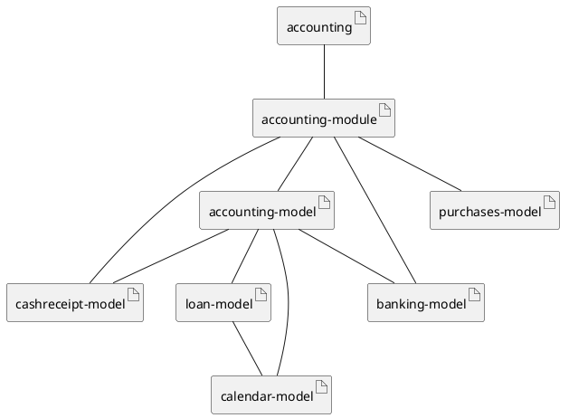

```plantuml
@startuml
    artifact "accounting"
    artifact accounting_module as "accounting-module"
    artifact cashreceipt_model as "cashreceipt-model"
    artifact purchases_model as "purchases-model"
    artifact loan_model as "loan-model"
    artifact banking_model as "banking-model"
    artifact accounting_model as "accounting-model"
    artifact calendar_model as "calendar-model"
    
    accounting -- accounting_module
    
    accounting_module -- cashreceipt_model
    accounting_module -- purchases_model
    accounting_module -- banking_model
    accounting_module -- accounting_model
    
    loan_model -- calendar_model
    
    accounting_model -- loan_model
    accounting_model -- banking_model
    accounting_model -- calendar_model
    accounting_model -- cashreceipt_model
@enduml
```

Shared dependencies are not included: ddd-shared, money-money, gov-model
